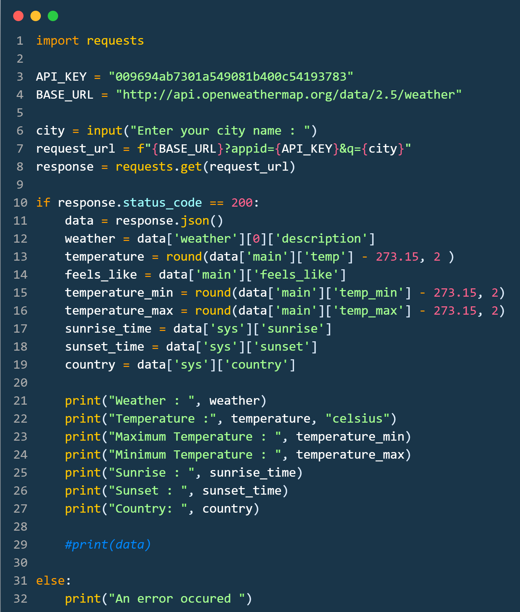

# Weather - Fetcher 

A brief description of what this project does and who it's for:

* To fetch weather of any city of any country using this project.
* The main theme behind choosing the project is to work with API's.


## Used By

This project is can be useful for :

- People who used to travel a lot from one place to another.
- Sports match representators.


## Features

- Will be able to fetch weather, overcast, sunset, sunrise.
- Minimum temperature.
- Maximum temperature.
- Country of a city.


## Technology used 

- Python with request module.

- Fetched API from openweather.api


## Screenshots




## API Reference

#### Get all items

```http
  GET /api/items
```

| Parameter | Type     | Description                |
| :-------- | :------- | :------------------------- |
| `api_key` | `string` | **Required**. 009694ab7301a549081b400c54193783 |

#### Get item

```http
  GET /api/items/${url}
```

| Parameter | Type     | Description                       |
| :-------- | :------- | :-------------------------------- |
| `id`      | `string` | **Required**. http://api.openweathermap.org/data/2.5/weather|


